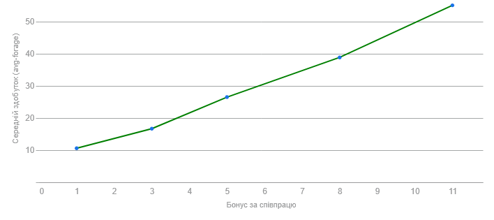

## Комп'ютерні системи імітаційного моделювання
## СПм-22-11, **Іванов Іван Іванович**
### Лабораторна робота №**1**. Опис імітаційних моделей та проведення обчислювальних експериментів

 

### Варіант 0, модель у середовищі NetLogo:
[Traffic Basic](http://www.netlogoweb.org/launch#http://www.netlogoweb.org/assets/modelslib/Sample%20Models/Social%20Science/Traffic%20Basic.nlogo)

 

### Вербальний опис моделі:
Симуляція руху автомобілів по шосе. Кожен автомобіль моделюється агентом, який дотримується простого набору правил: він уповільнюється (гальмує), якщо наближається до автомобілю попереду, і прискорюється (збільшує швидкість руху), якщо попереду нема перешкоди (іншого автомобіля). Модель показує, як можуть утворюватися пробки навіть без ДТП та перехресть.

### Керуючі параметри:
- **number-of-cars** визначає кількість агентів у середовищі моделювання, тобто, в даній моделі, кількість машин на замкнутому шосе.
- **deceleration** визначає зменшення швидкості агенту на кожному ігровому такті у разі присутності перешкоди перед ним.
- **acceleration** визначає збільшення швидкості агенту на кожному ігровому такті за умови відсутності перешкод перед агентом.

### Внутрішні параметри:
- **speed**. Швидкість агенту (переміщення машини трасою). Може відрізнятись у кожної машини в різні моменти модельного часу.
- **speed-limit**. Обмеження максимальної швидкості. Це загальний параметр для всіх агентів.
- **speed-min**. Мінімальне значення швидкості агентів. Це загальний параметр для всіх агентів.

### Показники роботи системи:
- максимальна швидкість на поточному такті симуляції, тобто, швидкість найшвидшої на даний момент машини на трасі. Не може перевищувати значення speed-limit.
- найменша швидкість на поточному такті, тобто, швидкість найповільнішої в даний момент машини.
- поточна швидкість машини, що відстежується (червона машина).

### Примітки:
При налаштуваннях керуючих параметрів за замовчуванням, автомобілі уповільнюються набагато швидше, ніж прискорюються.

### Недоліки моделі:
Гальмування починається тільки безпосередньо перед перешкодою, що протирічить реальному досвіду. Відстеження агентом простору тільки безпосередньо перед собою, хоча доцільно враховувати наявність перешкод на більшій відстані та скидати швидкість поступово по мірі наближення, використовуючи вказане користувачем значення deceleration.

 

## Обчислювальні експерименти
*// тут наведено опис лише одного експерименту, задля скорочення прикладу. Пам'ятайте, що при реальному виконанні л/р потрібно описати щонайменше 3 експерименту.* 
### 1. Вплив завантаженості дороги на середню швидкість переміщення нею
Досліджується залежність середньої швидкості червоної (випадково обраної) машини протягом певної кількості тактів (100) від числа машин на трасі, зазначеного на початку симуляції.
Експерименти проводяться при 5-40 машинах, з кроком 5, усього 8 симуляцій.  
Інші керуючі параметри мають значення за замовчуванням:
- **deceleration**: 0.026
- **acceleration**: 0.0045

<table>
<thead>
<tr><th>Кількість автомобілів</th><th>Середня швидкість</th></tr>
</thead>
<tbody>
<tr><td>5</td><td>0,47</td></tr>
<tr><td>10</td><td>0,38</td></tr>
<tr><td>15</td><td>0,46</td></tr>
<tr><td>20</td><td>0,44</td></tr>
<tr><td>25</td><td>0,30</td></tr>
<tr><td>30</td><td>0,14</td></tr>
<tr><td>35</td><td>0,16</td></tr>
<tr><td>40</td><td>0,14</td></tr>
</tbody>
</table>

Графік наочно показує, що утримання високої швидкості на більшій частині дороги можливе лише за її низької завантаженості, до 15-20 машин.

### 2. Перевірка гіпотези про те, що початкове розміщення машин на трасі не впливає на ефективність руху
...  
*// це як раз один з експериментів, що рекомендовано автором моделі. Але без корегування внутрішньої логіки моделі виконати таке дослідження неможливо - тобто таке можна розглядати у другій л/р. А у першій, найпростішим рішенням було б розглянути залежність швидкості від ступеня гальмування - аналогічно тому, як виконувалось дослідження у першому експерименті.*
### 3. Підбір значень параметрів deceleration та acceleration для уникнення пробок на трасі
...  
*// також одне з цікавих досліджень, але не у контексті першої лабораторної роботи. Бо без засобів автоматизації це буде лише ручний перебір (у якому ніякої науки) можливих комбінації значень, яких дуже багато навіть для такій примітивній моделі. Такий експеримент був би доцільним у третій л/р, яка присвячена як раз підбору параметрів - тобто завданню оптимізації моделей. А у першій л/р, при виборі дослідження для третього експерименту, найпростішим рішенням було б діяти за аналогією з попередніми - і розглянути залежність середньої швидкості від значення прискорення.*