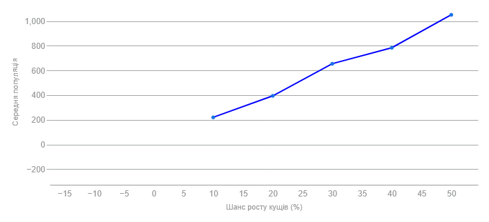
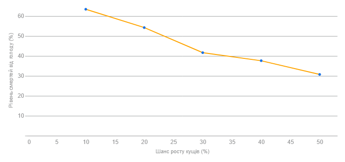
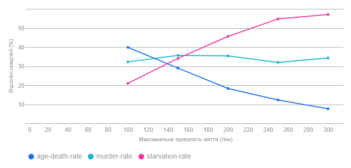

## Комп'ютерні системи імітаційного моделювання
## СПм-24-4, **Почуєнков Владислав Ігорович**
### Лабораторна робота №**1**. Опис імітаційних моделей та проведення обчислювальних експериментів

 

### Варіант 13, модель у середовищі NetLogo:
[Fruit Wars](https://www.netlogoweb.org/launch#http://www.netlogoweb.org/assets/modelslib/Sample%20Models/Social%20Science/Economics/Fruit%20Wars.nlogo)

 

### Вербальний опис моделі:
Модель "Fruit Wars" призначена для демонстрації того, як економічне середовище з ненульовою сумою (де виграш одного не обов'язково означає програш іншого) може сприяти розвитку співпраці та зменшувати рівень насильства.
Агенти, що називаються "збирачами" (foragers), блукають картою у пошуках фруктових кущів. Прибувши до куща, вони здобувають енергію шляхом збирання фруктів, доки кущ не вичерпає свої ресурси.  Коли запас енергії у куща вичерпується, він зникає.
Накопичивши певну кількість енергії, збирачі розмножуються і передають свої характеристики нащадкам.
Збирачі приймають рішення про взаємодію з іншими збирачами на основі успадкованих параметрів. Вони можуть обирати співпрацю, погрозу, бійку або втечу за різних обставин. Основний вибір базується на успадкованих атрибутах агресії: співпрацювати чи битися.
Модель показує еволюційні наслідки різних рівнів агресії та вплив бонуса за співпрацю на співпрацю між агентами.

### Керуючі параметри:
- **INITIAL-FRUIT-BUSHES** визначає кількість фруктових кущів на старті симуляції.
- **INITIAL-FORAGERS** Визначає кількість агентів-збирачів на старті.
- **BUSH-GROWTH-CHANCE** Ймовірність того, що на кожному кроці моделі з’явиться новий фруктовий кущ.
- **TICKS-TO-FLEE** Кількість тіків, протягом яких збирач, що вирішив тікати, повинен рухатися випадково, перш ніж зможе шукати новий кущ.
- **RATE-OF-MUTATION** Ймовірність того, що окремий біт у геномі агента зміниться під час передачі від батька до нащадка.
- **COLLABORATION-BONUS** Фактор, який визначає, наскільки вигідною є співпраця. Вищі значення цього бонусу означають вищу швидкість збирання енергії, коли біля одного куща перебуває декілька збирачів.
- **MAX-AGE** Максимальна кількість тіків, яку може прожити окремий збирач.

### Внутрішні параметри:
- **Strength, Speed, Intelligence** Три атрибути, що визначаються сумою перших 120 бітів геному. Вони впливають на успіх у бійці (strength), швидкість руху (speed) та ефективність групового збирання (intelligence).
- **Reactive-aggression** Визначається сумою бітів 120-180. Впливає на схильність агента погрожувати, коли він прибуває до куща, або коли хтось інший прибуває до куща, де він вже є.
- **Proactive-aggression** Визначається сумою бітів 180-240. Впливає на схильність агента битися у відповідь, коли йому погрожують.
-	**Energy Внутрішній ресурс** Збирачі витрачають 1 одиницю енергії на рух, здобувають енергію з кущів і витрачають 100 одиниць на розмноження (яке можливе при енергії понад 200). Смерть настає, якщо енергія закінчується.
-	**Age** Кількість тіків, яку прожив агент; смерть настає при перевищенні MAX-AGE.
-	**Genome** 240-бітна послідовність, яка кодує всі вищевказані параметри та передається нащадкам
-	**Status** Поточна поведінка агента (наприклад, "fleeing" або "foraging").

### Показники роботи системи:
- Загальний розмір популяції, який може підтримувати середовище
- Стандартний лінійний графік атрибутів збирачів (forager attributes) на кожному кроці
- Графік зміни з часом середніх значень (mean) двох типів агресії у всій популяції збирачів.
- Графік розподілу значень двох типів агресії серед усієї популяції збирачів (foragers) на поточний момент часу.
- Графік середньої швидкості збирання їжі (foraging rate) за один крок (тік).
- Кількість смертей в залежності від типу смерті

### Примітки:
- Бійки в моделі є летальними: якщо збирач, що прибув, виграє бійку, всі, хто бився проти нього, помирають; інакше помирає сам збирач, що прибув.
- Ключовим механізмом моделі є те, що атрибути агентів (сила, швидкість, інтелект, агресивність) є спадковими і визначаються бінарним геномом.
- Зміни в параметрах агресії відбуваються еволюційно через мутації.

### Недоліки моделі:
- Бійки завжди призводять до смерті одного з учасників; модель не передбачає нелетальних сутичок.
- Переможець у бійці не отримує жодних ресурсів (наприклад, енергії) від переможеного.
- Агент реагує тільки на безпосереднє оточення, не прогнозуючи наслідки майбутніх зіткнень.
- Співпраця або загроза визначаються лише одним параметром агресії без урахування зовнішніх факторів (дефіциту ресурсів, енергії тощо).

 

## Обчислювальні експерименти

### 1. Вплив бонуса за співпрацю на середній здобуток
Дослідити, як бонус за співпрацю (керований параметром COLLABORATION-BONUS) впливає на середню швидкість збору фруктів.
Інші керуючі параметри мають значення за замовчуванням:
- **initial-fruit-bushes**: 40
- **initial-foragers**: 40
- **bush-growth-chance**: 6
- **max-age**: 500
- **ticks-to-flee**: 49
- **rate-of-mutation**: 1

<table>
<thead>
<tr><th>Бонус за співпрацю</th><th>Середня шв. збирання</th></tr>
</thead>
<tbody>
<tr><td>1</td><td>10,58</td></tr>
<tr><td>3</td><td>16,66</td></tr>
<tr><td>5</td><td>26,46</td></tr>
<tr><td>8</td><td>38,82</td></tr>
<tr><td>11</td><td>55</td></tr>

</tbody>
</table>

Існує дуже сильна, пряма позитивна залежність. Чим вищий бонус за співпрацю, тим вища середня швидкість збирання фруктів. Це демонструє, що механіка моделі працює правильно: бонус безпосередньо збільшує ефективність спільного збирання. Здобуток зріс у 5 разів.

### 2. Вплив дефіциту ресурсів на стійкість популяції та конфліктність.
Дослідити, як доступність ресурсів (керована параметром BUSH-GROWTH-CHANCE) впливає на загальну чисельність популяції, яку може підтримувати середовище, та на рівень конфліктності (через голод та конкуренцію).
Інші керуючі параметри мають значення за замовчуванням:
- **initial-fruit-bushes**: 40
- **initial-foragers**: 40
- **collaboration-bonus**: 5
- **max-age**: 500
- **ticks-to-flee**: 49
- **rate-of-mutation**: 1
   
    <table>
<thead>
<tr><th>Шанс росту кущів</th><th>Сер. популяція</th><th>Смерті від голоду</th><th>Рівень вбивств</th></tr>
</thead>
<tbody>
<tr><td>10</td><td>220.05</td><td>63.37</td><td>32.59</td></tr>
<tr><td>20</td><td>393.83</td><td>54.19</td><td>43.1</td></tr>
<tr><td>30</td><td>654.37</td><td>41.61</td><td>55.73</td></tr>
<tr><td>40</td><td>783.92</td><td>37.57</td><td>58.55</td></tr>
<tr><td>50</td><td>1050.51</td><td>30.7</td><td>65.22</td></tr>

</tbody>
</table>

  
  
   Збільшення ресурсів (BUSH-GROWTH-CHANCE) знижує екологічний тиск (голод), але різко збільшує соціальний тиск (конфлікти).
Величезне зростання популяції призводить до того, що агенти набагато частіше стикаються один з одним біля кущів.

### 3. Вплив тривалості життя на причини смерті.
Дослідити, як максимальний вік (керована параметром MAX-AGE) впливає на рівень вбивств, рівень смертності від голоду та рівень смертності від старості.
Інші керуючі параметри мають значення за замовчуванням:
- **initial-fruit-bushes**: 40
- **initial-foragers**: 40
- **collaboration-bonus**: 5
- **bush-growth-chance**: 6
- **ticks-to-flee**: 49
- **rate-of-mutation**: 1

  <table>
<thead>
<tr><th>Макс. вік</th><th>Вбивства</th><th>Смерті від голоду</th><th>Смерті від старості</th></tr>
</thead>
<tbody>
<tr><td>100</td><td>32.25</td><td>21.01</td><td>39.87</td></tr>
<tr><td>150</td><td>35.63</td><td>34.05</td><td>29.01</td></tr>
<tr><td>200</td><td>35.41</td><td>45.59</td><td>18.32</td></tr>
<tr><td>250</td><td>31.94</td><td>54.78</td><td>12.28</td></tr>
<tr><td>300</td><td>34.3</td><td>57.12</td><td>7.64</td></tr>

</tbody>
</table>

  
- При MAX-AGE = 100: Головна причина смерті — старість.
- При MAX-AGE = 300: Смерть від старості майже зникає. Її місце займає голод (starvation-rate), який стає домінуючою причиною смерті.
- Вбивства (murder-rate): Рівень вбивств залишається стабільно високим у всіх сценаріях, підтверджуючи, що це постійний механізм конкуренції у перенаселеному середовищі.

